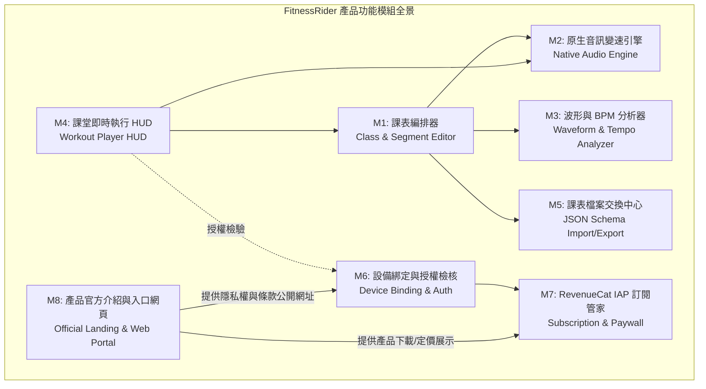

# FitnessRider 系統功能規格規劃書 (spec.md)

*版本：v1.0.0*  
*更新日期：2026-09-21*  
*狀態：正式規格核定*  

---

## 1. 產品概述與核心願景 (Product Overview)

### 1.1 產品定位
**FitnessRider** 是一款專為**室內飛輪教練（Spinning / Indoor Cycling Instructors）**打造的高效能專業教學工具。
本系統聚焦於飛輪課程的核心靈魂：**「音樂拍頻 (BPM) 與動作強度 (RPM / Cues) 的高度同步」**，提供教練極致流暢的**課表編排**、**高音質無損變速播音**以及**課堂即時橫向大螢幕中控引導**。

### 1.2 目標受眾與硬體場景
* **主要受眾**：商業健身房飛輪教練、精品飛輪工作室教練、私人單車訓練師。
* **主力硬體**：
  * **iPad (iPadOS 17+) 橫向模式 (Landscape)**：安裝於飛輪車把支架或教練台大螢幕。
  * **Android 平板 (Android 14+) 橫向模式**：作為跨平台備用與支援設備。
* **市場規模**：台灣約 200 位活躍專業教練，具備高單價、高黏著度之 Prosumer 特性。

---

## 2. 產品模組架構展開 (Module Architecture Breakdown)

FitnessRider 系統拆解為 **8 大核心功能模組**：



---

## 3. 各模組詳細功能規格 (Functional Specifications)

### 模組 M1：課表與段落編排器 (Class & Segment Editor)
教練用以規劃整堂 45~60 分鐘課堂之結構化工具。

* **M1.1 課程基本資訊**：
  * 課程標題（如「45min 燃脂間歇衝刺」）、難度等級、教練名稱。
  * 系統自動即時累計：總時長、總段落數、理論預估卡路里（依段落強度時間積分計算）。
* **M1.2 歌曲段落 (Segment) 管理**：
  * 支援單首歌曲對應一個訓練段落。
  * 拖曳排序（Drag & Drop）支援任意調整曲目順序。
  * 設定該段落的主要訓練目標：平路巡航 (Cruising)、爬坡 (Climbing)、衝刺間歇 (Sprint)、緩和恢復 (Recovery)。
* **M1.3 動作提示點 (Cue) 精準標記**：
  * 於歌曲時間軸任意秒數放置提示點。
  * 提示項目包含：
    * **騎乘姿勢**：坐姿 (Seated)、站姿 (Standing)、抽車 (Jumping)。
    * **阻力/踏頻指示**：目標 RPM (如 60~110 RPM)、阻力微調指令（如「右旋一圈半」）。
    * **自訂文字提醒**：如「最後 30 秒爆發，堅持住！」

---

### 模組 M2：原生音訊變速與節奏引擎 (Native Audio Engine)
飛輪教學中，教練經常需要微調音樂速度以精準契合學員踩踏節奏。

* **M2.1 變速不變調 (Pitch-Preserving TimePitch)**：
  * 支援 0.7x ~ 1.3x 連續無損速度調整（步進 0.01x 或以 BPM 為單位同步增減）。
  * 保持原曲音調（人聲不變尖、低音不失真）。
  * **iOS**：基於 `AVAudioEngine` + `AVAudioUnitTimePitch`。
  * **Android**：基於 `AndroidX Media3 (ExoPlayer)` + `PlaybackParameters`。
* **M2.2 雙軌平滑淡入淡出 (Crossfade)**：
  * 歌曲換首時自動無縫交錯淡入淡出（可設定 1~5 秒），避免課堂中出現尷尬靜音。
* **M2.3 系統級背景播放**：
  * 宣告 Audio Background Mode，App 進入背景或螢幕鎖定時音樂不中斷。
  * 整合系統控制中心與鎖定畫面（iOS `MPRemoteCommandCenter` / Android `MediaSession`）。

---

### 模組 M3：波形視覺化與 BPM 偵測 (Waveform & Tempo Analyzer)
* **M3.1 非同步音訊解碼與波形生成**：
  * 匯入音訊時，非同步讀取 PCM 緩衝區，降採樣計算振幅分佈。
  * 產出高解析度波形資料陣列，於編輯器以視網膜級流暢度滾動渲染。
* **M3.2 音樂拍頻 (BPM) 偵測**：
  * 移植並優化純數學峰值偵測演算法（Onset/Beat Peak Detection）。
  * 分析出歌曲原始 BPM（如 128 BPM），並支援教練手動 Tap-Tempo（輕敲測速）校正。

---

### 模組 M4：課堂即時執行中控儀表板 (Workout Player HUD)
課堂進行時教練放置於車架上的核心互動介面，採用全橫向大字高對比設計。

* **M4.1 視覺層次佈局 (Landscape Layout)**：
  * **左側/中央核心區**：
    * 動態環形倒數環：當前 Segment 剩餘時間倒數。
    * 當前核心指示：大字顯示當前目標 **RPM**、姿勢圖示（坐/站）、強度色帶（Zone 1 藍 ~ Zone 5 紅）。
    * 下一動作預告（Next Cue Preview）：提前 5~10 秒高亮閃爍提示（如「預備：5 秒後站姿爬坡」）。
  * **上方進度條**：全課堂時間軸進度、總消耗卡路里即時累加器。
  * **下方控音列**：大按鈕播放/暫停、快進/倒退、即時變速滑桿（Slider）與即時 BPM 顯示。
* **M4.2 課堂中斷防護**：
  * 課堂進行中強制保持螢幕常亮（Idle Timer Disabled）。
  * 意外跳出防護：若誤觸返回需彈窗二次確認，避免授課中斷。

---

### 模組 M5：課表檔案交換中心 (JSON Schema Import/Export)
* **M5.1 共通 JSON 課表規範 (`workout_class.json`)**：
  * 格式跨雙原生平台 100% 相容。
* **M5.2 一鍵分享與匯入**：
  * 支援 iOS AirDrop、檔案 App、LINE 分享課表檔案。
  * 匯入時自動比對本機是否存在對應音訊檔；若缺音訊檔，提示教練綁定本機同名歌曲。

---

### 模組 M6：雲端授權檢核與單一設備綁定 (Device Binding & Auth)
確保一組帳號限定一台設備使用，保障付費權益。

* **M6.1 現代設備唯一識別碼提取**：
  * **iOS**：`UIDevice.identifierForVendor` + **iOS Keychain 持久化保存**（防刪除 App 重裝作弊）。
  * **Android**：`Settings.Secure.ANDROID_ID` + **KeyStore** 安全存儲。
* **M6.2 Vercel Serverless 單機綁定檢核**：
  * 登入時送出 `{ email, password, device_fingerprint, device_model }`。
  * 首次登入自動綁定；若在第二台設備登入，回傳 `403 DEVICE_MISMATCH` 阻擋使用。
  * 提供「換機轉移設備」流程（限制每 30 天最多 1 次，防止共用）。

---

### 模組 M7：RevenueCat 跨平台 IAP 訂閱管家 (Subscription & Paywall)
* **M7.1 三層級訂閱方案**：
  1. **月繳**：NT$ 390 / 月
  2. **季繳**：NT$ 890 / 季 (約 NT$ 296 / 月)
  3. **年繳 (主力)**：NT$ 2,390 / 年 (約 NT$ 199 / 月)
* **M7.2 整合流程**：
  * App 端引入 RevenueCat SDK，以極簡 API 呼叫 Apple StoreKit 2 與 Google Play Billing。
  * 透過 RevenueCat Webhook 即時將付款/續訂事件推播至 Vercel 後端，更新資料庫 `licenses` 到期日。

---

### 模組 M8：產品官方介紹與服務入口網頁 (Official Landing Page & Web Portal)
架設於 Vercel 的現代化官方品牌響應式入口網站（同時作為 App Store 審查必備之支援與法律文件公開站點）。

* **M8.1 視覺首頁 (Hero & Product Showcase)**：
  * 產品標題與核心價值主張（「專為室內飛輪教練打造的音樂節奏與課表編排引擎」）。
  * 核心功能亮點卡片：
    * 🎵 **無損變速不變調**：自訂節奏契合踩踏踏頻。
    * ⏱️ **橫向大字課堂 HUD**：動態倒數環、當前姿勢與下一動作預告。
    * 📊 **視覺化波形與 BPM**：自動偵測歌曲節拍與音訊振幅。
    * 📱 **雙平台共通課表**：iPad 與 Android 平板隨意切換、課表一鍵分享。
  * App 下載引導（App Store / Google Play 徽章按鈕）。
* **M8.2 訂閱價格試算卡片 (Interactive Pricing Tiers)**：
  * 視覺化月繳 (NT$ 390)、季繳 (NT$ 890)、年繳 (NT$ 2,390) 三卡片。
  * 年繳方案標記「🔥 飛輪教練首選・現省 NT$ 2,290」。
  * 明確列出訂閱包含權益：無限課表建立、無損變速播放、全功能 HUD、課表備份匯出。
* **M8.3 教練常見問題 (FAQ)**：
  * 涵蓋：單一設備綁定如何運作？換新 iPad 如何轉移？音樂需要連上網才能播嗎（100% 離線可用）？
* **M8.4 App Store 審查強制必備之公開法律頁面**：
  * **隱私權政策 (Privacy Policy)**：載明不搜集多餘個資、僅使用設備識別碼做授權綁定。
  * **使用者服務條款 (Terms of Service / EULA)**：載明訂閱週期、自動續約條款與退訂方式。
  * **支援與客服聯繫 (Support Contact)**：提供教練反饋管道（Email / LINE 官方諮詢）。

---

## 4. 共通資料格式規範 (JSON Data Contract)

```json
{
  "$schema": "https://fitnessrider.app/schemas/workout_class_v1.json",
  "version": "1.0",
  "classId": "550e8400-e29b-41d4-a716-446655440000",
  "title": "45min 高強度間歇爬坡",
  "author": "Coach Tony",
  "createdAt": "2026-09-21T08:00:00Z",
  "totalDurationMs": 2700000,
  "estimatedCalories": 420.5,
  "segments": [
    {
      "segmentId": "a1b2c3d4-e5f6-7a8b-9c0d-1e2f3a4b5c6d",
      "orderIndex": 0,
      "title": "熱身與節奏平路",
      "musicFileName": "warmup_track.mp3",
      "durationMs": 300000,
      "baseBpm": 128.0,
      "playbackRate": 1.0,
      "intensityZone": 2,
      "cues": [
        {
          "cueId": "cue-01",
          "offsetMs": 0,
          "posture": "SEATED_FLAT",
          "targetRpm": 80,
          "resistanceLevel": "LIGHT",
          "message": "坐姿平路，輕鬆踩踏建立踏頻"
        },
        {
          "cueId": "cue-02",
          "offsetMs": 120000,
          "posture": "STANDING_CLIMB",
          "targetRpm": 65,
          "resistanceLevel": "HEAVY",
          "message": "起立站姿爬坡，增加兩圈阻力"
        }
      ]
    }
  ]
}
```

---

## 5. 非功能性需求與指標 (Non-Functional Requirements)

| 指標類別 | 規格標準 | 驗證方式 |
| :--- | :--- | :--- |
| **音訊播放延遲** | 變速或 Seeking 響應時間 < 50ms | `AVAudioEngine` 緩衝區監控 |
| **介面幀率 (FPS)** | 橫向 HUD 動畫與波形滾動恆定 60 FPS (ProMotion 120 FPS) | Instruments Core Animation 檢測 |
| **離線授權寬限** | 支援最長 7 天離線無網路使用（離線快取 JWT 憑證） | 斷網模式驗證課堂執行功能 |
| **記憶體佔用** | 60 分鐘課堂音訊播放記憶體穩定 < 120 MB | Instruments Allocations / Leaks 檢測 |
| **設備相容性** | iPadOS 17+ (全螢幕橫向) / Android 14+ (平板橫向) | 實機測試 |

---

## 6. 經典原生佈局與純白草綠視覺設計 (FitnessRider Classic Clean UI Specification)

嚴格忠於舊版 Android 經典資訊架構與版面配置（`activity_class_list.xml`、`activity_class_editor.xml`、`activity_class_execute.xml`、`fragment_class_progress.xml`），去除多餘繁雜資訊，以**純白畫布配經典草綠（#84BF09）**重構高解析度現代化版面：

* **Stitch Project ID**：`16053146227512897618`
* **Design System Asset**：`assets/10356087142240876331` (FitnessRider Classic Clean)
* **核心品牌語彙與色彩規格**：
  * **經典頂部工具列 (Signature TopBar)**：草綠色底 (`#84BF09`)，搭配純白圖標與白色文字，保留舊版最標誌性的視覺品牌記憶。
  * **純白內容畫布 (Canvas Background)**：純淨純白 (`#FFFFFF`)，搭配淺灰卡片層次 (`#F2F4F7` / `#EAEAEA`，邊框 `#E2E8F0`)。
  * **主重點按鈕與進度**：活力運動草綠 (`#84BF09`)，用於 Play 播放按鈕、進度條、當前編輯中段落與 RPM 標籤。
  * **高對比文字**：炭黑 (`#313131`) 與中度灰 (`#606060`)，簡單乾淨、一目了然。
  * **極簡原則**：**完全剔除瓦特數、複雜功率曲線、多重儀表等雜訊**，專注於飛輪課堂最關鍵的四項核心指標：**時間、目標 RPM、音樂 BPM、動作姿勢與阻力段位**。

### 核心畫面原型 (Faithfully Recreated from Legacy App)

#### 1. 課表清單 (Class List)
* **對應舊版**：`activity_class_list.xml` + `listview_class.xml`
* **Screen ID**：`53c192e43eed4a4da42646439e41a5a1`
* **畫面設計亮點**：
  * **頂部綠色列 (#84BF09)**：左側「返回鍵」、中間「課表清單」白色標題、右側「刪除/垃圾桶」與「+ 新增課表」按鈕。
  * **垂直課表卡片**：
    * 上半部（淺灰底 `#F2F4F7`）：課表名稱（如 `45min 高強度間歇爬坡`）、時長與卡路里（`2700 秒 / 420 kcal`）。
    * 下半部（白底）：綠色圓形播放按鈕（`Play`）、橫向彩色段落長度比例預覽條（暖身、爬坡、衝刺、緩和）、鉛筆編輯按鈕（`Edit`）。
    * 底部乾淨狀態列：顯示設備連線就緒。

#### 2. 課表與段落編輯器 (Class & Segment Editor)
* **對應舊版**：`activity_class_editor.xml` + `activity_segment_editor.xml`
* **Screen ID**：`b806006e7b334a5e9ef3fda6ce8fdf92`
* **畫面設計亮點**：
  * **頂部綠色列 (#84BF09)**：左側「取消 (Cancel)」、中間可直接編輯的課表標題膠囊框、右側「清空段落」與「確定 (OK)」。
  * **次資訊列**：時鐘圖示（`總時長: 45:00`）、卡路里圖示（`預估消耗: 420 kcal`）、匯入音樂按鈕。
  * **上半部（段落序列卡片）**：橫向滾動的段落卡片清單，顯示曲名、時長、BPM 與 Cue 點數量；選中段落以綠框 `#84BF09` 突顯；末端為醒目的虛線「+ 新增段落」卡片。
  * **下半部（波形與動作設定）**：
    * 乾淨的音訊波形畫布，標記該段落所有 Cue 點時間位置。
    * 簡單實用的設定列：姿勢選單（坐平、站平、站爬、衝刺）、目標踏頻（RPM）、建議阻力段位，以及播放試聽鍵與音速微調滑桿（-2%, +0%, +2%）。

#### 3. 課堂即時執行 HUD (Class Execution HUD)
* **對應舊版**：`activity_class_execute.xml` + `fragment_class_progress.xml`
* **Screen ID**：`a0cea69b665a41318925d11ea979c1ce`
* **畫面設計亮點**：
  * **頂部綠色列 (#84BF09)**：左側「返回鍵」與「歌單抽屜鍵」；中間課表名稱與卡路里；右側歌曲進度 Seek 條、上一首、Play/Pause 巨型按鈕、下一首、停止按鈕。
  * **左側 30%（歌單抽屜）**：展示課堂曲目清單，正在播放的歌曲以草綠色 `#84BF09` 醒目反白，清楚顯示播放進度。
  * **右側 70%（核心大字圓環儀表 - 忠實復刻 CircleProgressBar）**：
    * **超大綠色圓環進度條**：直徑 320px，動態顯示當前區間倒數進度。
    * **圓環正中心**：特大字體目標踏頻（**`85 RPM`**）、音樂節拍（**`128 BPM`**）、當前動作名稱（**`站姿重爬坡`**）、區間倒數秒數（**`00:45`**）與騎乘姿勢圖示。
    * **圓環下方簡單資訊**：段落時間、建議阻力（`LEVEL 7`）、音樂微調鈕（`±2%`）。
    * **底部單一橫條**：乾淨俐落的下一動作預告：「`下一動作: 坐姿衝刺 (110 RPM, 阻力 5 段) — 45 秒後轉換`」。

---

*文件產出完畢。後續 Native 開發需嚴格遵照本功能規格書與 Stitch 設計系統規範。*
